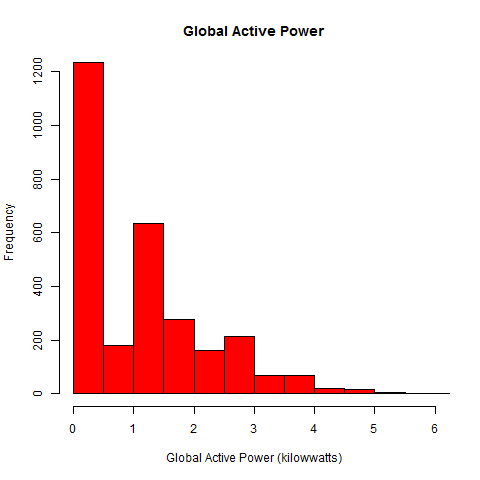
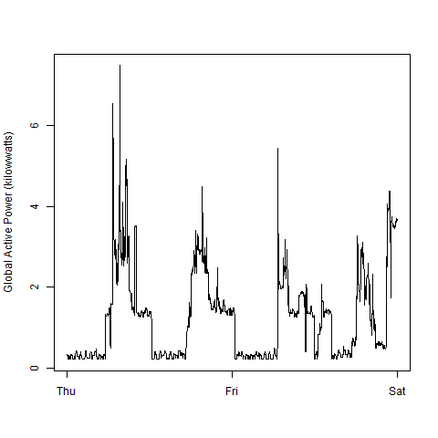
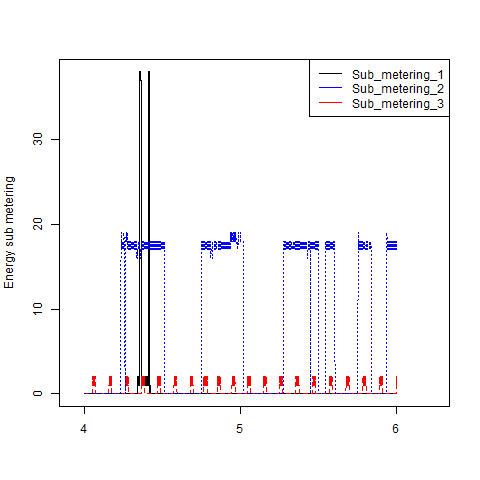
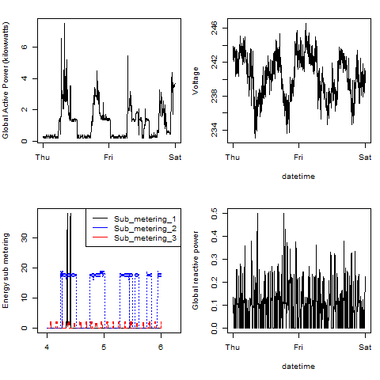

## Assignment Resolution - General Comments

<b>Author</b>: Patricia Chavez
<b>Environment</b>:                                  
    * platform       x86_64-w64-mingw32          
    * language       R                           
    * version.string R version 3.2.0 (2015-04-16)

This content including the generated code and plots is my answer to 
the Project 1 assignment for the course <b>Exploratory Data Analysis</b>
of the <b>Data Science Specialization</b> offered in <b>Coursera</b> by
<b>Johns Hopkins University</b>

* <b>Requirements to run Code</b>: directory <b>~/DataScientist/ExploratoryDataA/Project 1</b> should exists
* <b>Dataset source</b>: <a href="https://d396qusza40orc.cloudfront.net/exdata%2Fdata%2Fhousehold_power_consumption.zip">Electric power consumption</a>
data from the <a href="http://archive.ics.uci.edu/ml/">UC Irvine Machine
Learning Repository</a>. In particular, the file used was the "Individual household
electric power consumption Data Set"
* <b>Results of running the Code</b>:
     * File will be douwnloaded, unzipped and read in the <b>Download</b> subdirectory
     * Plots png files will be created in the <b>Download</b> subdirectory

### Plot 1
 

* <b>Code</b>: <a href="https://github.com/patichc/ExData_Plotting1/blob/master/figure/Plot1.R">plot1.R</a>

### Plot 2
 

* <b>Code</b>: <a href="https://github.com/patichc/ExData_Plotting1/blob/master/figure/Plot2.R">plot2.R</a>

### Plot 3
 

* <b>Code</b>: <a href="https://github.com/patichc/ExData_Plotting1/blob/master/figure/Plot3.R">plot3.R</a>

### Plot 4
 

* <b>Code</b>: <a href="https://github.com/patichc/ExData_Plotting1/blob/master/figure/Plot4.R">plot4.R</a>

### Thank you for reviewing this assignment!

